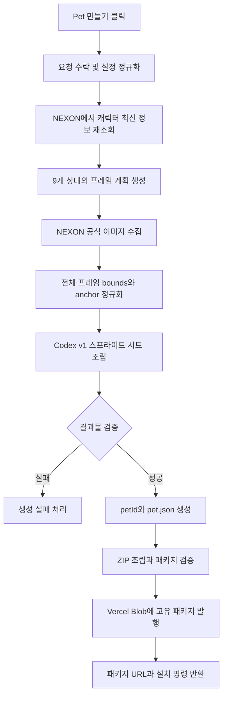

# Pet 생성 비즈니스 로직

- 상태: 구현 기준 확정
- 최종 수정: 2026-08-16
- 관련 문서: [Maple Hatch Pet MVP PRD](./mvp.md), [설치 사용자 계약](./installation-contract.md), [CLI 설치 계약](./cli-installation-contract.md), [개발환경](../development-environment.md)

## 1. 목적

이 문서는 사용자가 캐릭터 조회와 상태 설정을 마친 뒤 `Pet 만들기` 버튼을 눌렀을 때, 서비스가 Codex v1 Pet을 생성해 설치 수단을 반환하기까지의 비즈니스 로직을 정의한다.

검증된 PNG 스프라이트 시트는 `pet.json`과 함께 `.codex-pet.zip`으로 묶어 Vercel Blob 공개 저장소에 발행한다. MVP는 Pet 메타데이터 데이터베이스와 NEXON 조회 캐시를 사용하지 않는다. 공개·내부 API 경로, 객체 접두사와 응답 스키마는 이 문서에서 고정한다.

MVP 생성은 하나의 Node.js Route Handler가 동기 요청으로 처리한다. 작업 큐, 폴링과 실시간 진행 알림은 실행 한도에 가까운 처리 시간이나 타임아웃이 실제로 관찰된 뒤 별도 설계로 검토한다.

## 2. 시작 조건

생성 요청을 시작하려면 다음 조건을 만족해야 한다.

- 사용자가 닉네임 조회를 완료했다.
- 화면에 캐릭터 이름, 월드, 직업, 레벨과 현재 외형이 표시되어 있다.
- 9개 Codex 상태에 적용할 설정이 존재한다.
- `running-left`와 `running-right`를 제외한 7개 상태에는 액션과 표정이 선택되어 있다.
- 두 걷기 상태에는 표정이 선택되어 있다.

화면에 표시된 OCID, 캐릭터 이미지 URL과 기본 정보는 미리보기용이다. 생성 서버는 브라우저가 보낸 해당 값을 신뢰하지 않고 닉네임으로 최신 정보를 다시 조회한다. 조회 결과는 요청 사이에 캐시하지 않는다.

## 3. API 계약

### 3.1 `POST /api/characters/lookup`

요청은 닉네임만 받는다.

```json
{
  "characterName": "천짱"
}
```

성공 응답은 조회 화면과 미리보기에 필요한 값만 반환한다.

```json
{
  "character": {
    "name": "천짱",
    "world": "<world>",
    "class": "<class>",
    "level": 200,
    "imageUrl": "https://open.api.nexon.com/static/maplestory/character/look/<id>"
  },
  "catalogVersion": 1
}
```

서버는 OCID를 브라우저에 반환하지 않는다. `imageUrl`은 정확히 `https://open.api.nexon.com/static/maplestory/character/look/` 아래의 URL만 허용한다.

### 3.2 `POST /api/pets`

브라우저는 생성 요청에 닉네임, 카탈로그 버전과 상태 설정만 보낸다.

```json
{
  "characterName": "천짱",
  "catalogVersion": 1,
  "states": {
    "idle": { "action": "A01", "emotion": "E00" },
    "running-right": { "emotion": "E00" },
    "running-left": { "emotion": "E00" },
    "waving": { "action": "A00", "emotion": "E02" },
    "jumping": { "action": "A06", "emotion": "E00" },
    "failed": { "action": "A04", "emotion": "E03" },
    "waiting": { "action": "A07", "emotion": "E05" },
    "running": { "action": "A00", "emotion": "E00" },
    "review": { "action": "A00", "emotion": "E05" }
  }
}
```

브라우저가 OCID, 월드, 직업 또는 캐릭터 이미지 URL을 함께 보내더라도 생성 판단의 근거로 사용하지 않는다.

생성이 성공하면 생성 화면의 설치 명령 칸을 갱신하는 데 필요한 다음 정보를 반환한다.

```json
{
  "displayName": "천짱",
  "description": "<world> <class> 캐릭터",
  "petId": "123e4567-e89b-12d3-a456-426614174000",
  "packageUrl": "https://<service-origin>/api/pets/123e4567-e89b-12d3-a456-426614174000/package",
  "installCommand": "npx maple-hatch-pet add 123e4567-e89b-12d3-a456-426614174000",
  "expiresAt": "2026-09-06T12:34:56.000Z"
}
```

`petId`는 생성마다 발급하는 소문자 UUID다. `packageUrl`은 같은 응답의 `petId`를 사용하는 Production 서비스의 절대 HTTPS 다운로드 URL이며 설치 UI에는 노출하지 않는다. `installCommand`는 정확히 `npx maple-hatch-pet add <petId>` 형식이다. `expiresAt`은 생성 시각부터 정확히 28일 뒤의 UTC ISO 8601 값이다. 같은 캐릭터와 같은 설정으로 다시 생성해도 새 `petId`와 패키지를 발행한다.

경미한 잘림이나 상태 간 크기 차이는 생성을 막지 않으며 성공 응답과 설치 UI에는 포함하지 않는다.

### 3.3 `GET /api/pets/<petId>/package`

CLI가 `petId`로 생성 패키지를 내려받는 공개 API다. 경로의 `petId`는 소문자 UUID여야 한다. 서버는 DB를 조회하지 않고 `pet-packages/<petId>.codex-pet.zip` 객체 키를 결정적으로 계산한다.

성공 응답은 `application/zip` 콘텐츠 타입의 패키지 바이트를 반환한다. 리다이렉트나 Blob 원본 URL을 반환하지 않는다.

| HTTP | 대표 코드 | 의미 |
|---:|---|---|
| 400 | `INVALID_REQUEST` | `petId` 형식이 잘못됨 |
| 404 | `PET_PACKAGE_NOT_FOUND` | 패키지가 만료되었거나 존재하지 않음 |
| 503 | `SERVICE_UNAVAILABLE` | Blob 저장소를 일시적으로 사용할 수 없음 |

오류는 3.5의 공통 envelope을 사용한다. 패키지 바이트·크기·ZIP 검증과 CLI 보안 계약은 [CLI 설치 계약](./cli-installation-contract.md)을 따른다.

### 3.4 `GET /api/internal/cron/pet-assets`

Vercel Cron만 호출하는 내부 정리 API다. `Authorization: Bearer <CRON_SECRET>`가 일치하지 않으면 요청을 거부한다. Production Blob 저장소의 `pet-packages/` 접두사를 cursor로 끝까지 순회하고 각 객체의 `uploadedAt`이 현재 시각보다 28일 이상 이전이면 삭제한 뒤 다음 형태로 응답한다.

```json
{
  "deletedCount": 12,
  "cutoff": "2026-08-09T03:00:00.000Z"
}
```

`cutoff`은 실행 시각에서 28일을 뺀 UTC 시각이다. 정리 작업은 매일 03:00 UTC에 예약한다. Vercel Hobby Cron은 지정된 시간의 한 시간 안에서 실행될 수 있으므로 `expiresAt`은 28일로 안내하되 모든 생성 패키지는 최대 30일 이내 삭제한다.

### 3.5 공통 오류

네 API의 오류 응답은 항상 같은 envelope을 사용한다.

```json
{
  "error": {
    "code": "RATE_LIMITED",
    "message": "잠시 후 다시 시도해 주세요.",
    "retryable": true
  }
}
```

| HTTP | 대표 코드 | 의미 | `retryable` |
|---:|---|---|---|
| 400 | `INVALID_REQUEST` | 닉네임, 카탈로그 버전, 상태 코드 또는 요청 형식이 잘못됨 | `false` |
| 404 | `CHARACTER_NOT_FOUND` | 현재 조회 가능한 캐릭터가 없음 | `false` |
| 404 | `PET_PACKAGE_NOT_FOUND` | 패키지가 만료되었거나 존재하지 않음 | `false` |
| 409 | `UNUSABLE_CHARACTER_FRAMES` | 현재 외형과 선택한 설정으로 유효한 프레임을 구성할 수 없음 | `false` |
| 429 | `RATE_LIMITED` | 서비스 또는 NEXON 요청 제한에 도달함 | `true` |
| 502 | `UPSTREAM_ERROR` | NEXON API 또는 공식 이미지 응답이 실패함 | `true` |
| 503 | `SERVICE_UNAVAILABLE` | 생성 시간이 내부 제한에 도달했거나 저장소를 일시적으로 사용할 수 없음 | `true` |
| 500 | `INTERNAL_ERROR` | 분류되지 않은 서버 내부 오류 | `true` |

구체적인 내부 오류나 비밀값은 `message`에 포함하지 않는다. Cron 인증 실패는 같은 envelope과 HTTP 404를 사용해 내부 경로의 존재를 추가로 노출하지 않는다.

## 4. 전체 흐름



생성 시도는 다음 비즈니스 상태를 순서대로 지난다.

| 상태 | 의미 |
|---|---|
| `accepted` | 생성 요청과 사용자 설정을 수락했다. |
| `fetching-character` | NEXON API에서 최신 캐릭터 정보를 조회하고 있다. |
| `resolving-frames` | 상태별 액션 하위 프레임과 반복 순서를 결정하고 있다. |
| `rendering` | 공식 이미지를 수집하고 셀을 만들고 있다. |
| `validating` | 완성된 v1 스프라이트 시트와 패키지를 검증하고 있다. |
| `publishing` | 검증된 패키지를 HTTPS 주소로 발행하고 있다. |
| `ready` | 설치 가능한 결과가 준비되었다. |
| `failed` | 어느 단계에서든 생성이 중단되었다. |

이 상태는 하나의 동기 요청 안에서 순서대로 진행되는 내부 처리 단계다. 이후 비동기 실행 모델을 별도로 도입하더라도 사용자에게 보이는 상태의 의미는 유지한다.

## 5. 단계별 로직

### 5.1 요청 수락과 설정 정규화

1. 닉네임의 앞뒤 공백을 제거한다.
2. 9개 상태가 모두 존재하는지 확인한다.
3. `catalogVersion`이 `1`인지 확인하고 [액션·표정 카탈로그](./action-emotion-catalog.md)에 정의된 액션과 표정만 허용한다.
4. `running-left`와 `running-right`의 액션 입력은 받지 않는다.
5. 걷기 액션은 두 방향 모두 `A03`으로 고정한다.
6. 모든 표정 코드를 명시적인 0번 프레임으로 정규화한다. 예를 들어 `E06`은 `E06.0`이 된다.
7. 상태 순서를 Codex v1 행 순서로 고정한다.

정규화 결과의 상태 순서는 다음과 같다.

```text
idle
running-right
running-left
waving
jumping
failed
waiting
running
review
```

### 5.2 캐릭터 최신 정보 재조회

1. 서버가 보유한 NEXON API 키로 닉네임에 해당하는 OCID를 조회한다.
2. 받은 OCID로 캐릭터 기본 정보를 조회한다.
3. 이름, 월드, 직업, 레벨과 `character_image`를 확보한다.
4. `character_image`의 origin과 pathname이 정확히 `https://open.api.nexon.com/static/maplestory/character/look/` 아래인지 확인한다.

리다이렉트는 허용하지 않는다. 원본 응답 URL을 그대로 이어 붙이지 않고 허용된 기본 경로에서 `action`, `emotion`, `wmotion`, `width`, `height`, `x`, `y`만 서버가 다시 구성한다.

조회 결과는 요청 사이에 저장하거나 캐시하지 않는다. 하나의 생성 요청 안에서 동일한 최종 NEXON 이미지 URL을 다시 사용해야 할 때만 메모리에서 재사용한다.

캐릭터가 없거나 기본 정보를 얻지 못하면 이후 단계로 진행하지 않는다. NEXON API 키와 원본 응답의 불필요한 필드는 브라우저 또는 생성 결과에 포함하지 않는다.

### 5.3 상태별 프레임 계획 생성

각 상태는 선택된 액션의 공식 하위 프레임을 번호 순서대로 사용한다. 해당 액션에 하위 프레임이 여러 개 있으면 필요한 프레임 수가 찰 때까지 순환 반복한다. 선택한 표정은 항상 0번 하위 프레임으로 고정해 해당 상태의 모든 액션 프레임에 동일하게 적용한다.

| 상태 | 목표 프레임 수 | 액션 결정 | 방향 처리 |
|---|---:|---|---|
| `idle` | 6 | 사용자 선택 | 원본 방향 |
| `running-right` | 8 | 시스템 고정 `A03` | 왼쪽 걷기 각 프레임 좌우 반전 |
| `running-left` | 8 | 시스템 고정 `A03` | 원본 방향 |
| `waving` | 4 | 사용자 선택 | 원본 방향 |
| `jumping` | 5 | 사용자 선택 | 원본 방향 |
| `failed` | 8 | 사용자 선택 | 원본 방향 |
| `waiting` | 6 | 사용자 선택 | 원본 방향 |
| `running` | 6 | 사용자 선택 | 원본 방향 |
| `review` | 6 | 사용자 선택 | 원본 방향 |

예시는 다음과 같다.

```text
idle:
A01.0 + E00.0 → A01.1 + E00.0 → A01.2 + E00.0
→ A01.0 + E00.0 → A01.1 + E00.0 → A01.2 + E00.0

running-left:
A03.0 + E00.0 → A03.1 + E00.0 → A03.2 + E00.0 → A03.3 + E00.0
→ A03.0 + E00.0 → A03.1 + E00.0 → A03.2 + E00.0 → A03.3 + E00.0

running-right:
running-left의 같은 순서와 타이밍을 유지한 채 각 프레임만 좌우 반전
```

계획에 포함된 공식 프레임을 하나라도 조회하거나 디코딩할 수 없으면 제한된 재시도 후 전체 생성을 중단한다. 빈 프레임을 건너뛰거나 같은 액션의 다른 프레임, 다른 액션 또는 기본 자세로 자동 대체하지 않는다.

### 5.4 공식 이미지 수집

각 프레임은 NEXON이 반환한 `character_image` URL에 다음 파라미터를 설정해 요청한다.

```text
action=<action-and-frame>
emotion=<emotion-code>.0
wmotion=W04
width=400
height=400
x=200
y=280
```

- `W04`를 사용해 무기를 제외한다.
- 동일한 최종 URL은 생성 시도 안에서 한 번만 다운로드한다.
- 사용자가 전달한 임의 URL은 다운로드하지 않는다.
- 이미지 요청이 실패하면 제한된 횟수만 재시도하고, 계속 실패하면 전체 생성을 중단한다.
- 응답을 이미지로 디코딩할 수 없거나 알파 채널의 가시 픽셀이 하나도 없으면 전체 생성을 중단한다.
- NEXON이 요청한 `400 × 400`과 다른 크기로 응답할 수 있으므로 가로와 세로가 각각 `96`부터 `1000` 범위인 실제 디코딩 크기를 사용한다. 한 생성 시도의 프레임 크기가 서로 다르면 공통 좌표계를 유지할 수 없으므로 전체 생성을 중단한다.

### 5.5 크기와 anchor 정규화

액션마다 원본 이미지의 캐릭터 크기와 위치가 달라도 상태 전환이 튀거나 넓은 동작이 잘리지 않도록 모든 프레임에 하나의 공통 변환을 적용한다.

1. 모든 프레임을 `400 × 400`, `x=200`, `y=280`로 요청하고, 응답이 동일한 실제 디코딩 크기를 사용하는지 확인해 그 크기를 원본 좌표계로 삼는다.
2. 모든 원본 프레임의 알파 채널에서 가시 픽셀 bounds를 계산한다.
3. 원본 크기가 작을 때의 확대를 포함해 전체 bounds와 8픽셀 안전 여백이 `192 × 208` 셀 안에서 최대한 크게 보이는 공통 scale을 한 번 계산한다.
4. 원본 좌표계의 공통 anchor를 셀의 고정 위치에 대응시키는 변환을 계산한다.
5. 각 프레임에 같은 scale과 anchor 변환을 적용해 프레임 사이의 상대 위치를 유지한다.
6. `running-right`만 셀의 고정 anchor를 기준으로 프레임 단위 좌우 반전한다.
7. 완전히 투명한 픽셀의 RGB 값을 제거한다.

NEXON이 반환한 원본 이미지 경계에서 이미 일부가 잘렸거나 공통 변환 후 안전 여백을 침범해도 사용자의 액션 선택을 바꾸거나 생성 자체를 막지는 않는다. 해당 판정은 성공 응답과 설치 UI에 포함하지 않는다. 프레임마다 별도로 확대하거나 바닥 정렬하지 않으므로 점프 높이와 액션 고유의 위치 변화가 유지되어야 한다.

### 5.6 v1 스프라이트 시트 조립

- 투명한 `1536 × 1872` 캔버스를 만든다.
- 셀 크기는 `192 × 208`이다.
- 상태를 8열 × 9행에 정해진 순서로 배치한다.
- 각 행에서 사용하지 않는 나머지 셀은 완전히 투명하게 유지한다.
- 결과는 PNG로 인코딩한다.

### 5.7 결과물 검증

다음 검증을 모두 통과해야 자산을 발행할 수 있다.

- 파일 형식이 PNG다.
- 전체 크기가 정확히 `1536 × 1872`다.
- 파일 크기가 20 MiB 이하다.
- 알파 채널과 투명 배경이 존재한다.
- 사용하기로 한 모든 셀이 비어 있지 않다.
- 사용하지 않는 셀은 완전히 투명하다.
- 프레임 순서가 상태별 계획과 일치한다.

크기 차이 또는 일부 잘림은 발행을 막지 않는 판정이다. 잘못된 파일 크기, 빈 필수 셀, 불투명 배경 또는 용량 초과는 발행을 막는 오류다. 미리보기는 픽셀 검증을 수행하지 않으므로 생성 서버의 판정을 최종 결과로 사용한다.

### 5.8 패키지 조립과 발행

1. 스프라이트 검증을 통과한 뒤 생성 결과마다 소문자 UUID `petId`를 발급한다.
2. `id`가 `petId`와 일치하고 `spriteVersionNumber: 1`, `spritesheetPath: "spritesheet.png"`를 사용하는 `pet.json`을 만든다.
3. ZIP 루트에 `pet.json`과 검증된 PNG를 `spritesheet.png`라는 이름으로 넣어 `<petId>.codex-pet.zip`을 조립한다.
4. ZIP 엔트리, manifest 일치, 압축·해제 크기와 스프라이트 규격을 다시 검증한다.
5. 검증된 패키지를 현재 환경의 Vercel Blob 공개 저장소에 `pet-packages/<petId>.codex-pet.zip` 경로로 업로드한다.
6. 업로드한 패키지의 콘텐츠 타입과 HTTPS 다운로드 가능 여부를 확인한다.
7. 생성 시각부터 28일 뒤를 `expiresAt`으로 계산한다.
8. `packageUrl`과 `npx maple-hatch-pet add <petId>` 형식의 `installCommand`를 만든다.
9. 생성 화면에 필요한 `displayName`, `description`, `petId`, `packageUrl`, `installCommand`, `expiresAt`을 반환한다. 발행을 막지 않은 판정은 응답에 포함하지 않는다.

`petId`는 Blob 객체 키, `pet.json.id`와 다운로드 경로를 연결하는 유일한 식별자다. 별도 DB나 메타데이터 테이블을 만들지 않는다. 이미 발행한 객체를 덮어쓰지 않으며 같은 입력으로 다시 생성해도 새로운 UUID와 객체를 사용한다. 패키지 구조와 검증 세부사항은 [CLI 설치 계약](./cli-installation-contract.md)을 따른다.

## 6. 실패와 재시도

| 실패 단계 | HTTP | 처리 |
|---|---:|---|
| 요청 검증 | 400 | 생성 작업을 시작하지 않고 수정할 입력을 알려준다. |
| 캐릭터 없음 | 404 | 닉네임과 조회 가능 시점을 확인하게 한다. |
| 이미지 수집 | 502 | 제한된 재시도 후 실패하면 전체 생성을 종료한다. |
| 빈 프레임 | 409 | 해당 상태와 프레임을 알려주고 설정 변경을 요구한다. |
| 이미지 처리·결과 검증 | 500 | 중간 파일을 공개하지 않고 실패 이유를 비식별 로그에 남긴다. |
| 내부 50초 제한 | 503 | 발행하지 않고 재시도 가능한 오류로 종료한다. |
| 패키지 조립·검증 | 500 | 중간 ZIP을 공개하지 않고 종료한다. |
| 패키지 업로드 | 503 | 설치 명령을 갱신하지 않고 종료한다. |
| 패키지 다운로드 | 404/503 | 만료·미존재는 재생성을, 저장소 장애는 재시도를 안내한다. |
| 요청 제한 | 429 | 지정된 시간이 지난 뒤 재시도하게 한다. |

실패한 생성은 `ready` 상태가 될 수 없다. 사용자에게는 실패 단계의 내부 구현보다 다시 시도할 수 있는지와 설정을 바꿔야 하는지를 중심으로 안내한다.

## 7. 원자성과 중복 요청

- PNG·ZIP 검증과 HTTPS 업로드가 모두 끝나기 전에는 설치 가능한 결과를 노출하지 않는다.
- 실패한 생성의 중간 이미지, manifest와 ZIP을 정상 Pet 패키지로 취급하지 않는다.
- 사용자가 생성 버튼을 연속으로 눌러도 같은 화면에서 동시에 여러 생성 요청이 시작되지 않게 한다.
- 서버는 같은 생성 요청이 재전송되더라도 부분 자산을 덮어쓰거나 서로 다른 단계의 결과를 섞지 않는다.
- 성공한 생성은 항상 별개의 새 `petId`와 패키지로 발행하며 기존 객체를 변경하지 않는다.

## 8. 로그 항목

요청별 로그에는 요청 ID, API 경로, 처리 시간, 현재 또는 실패한 비즈니스 상태, HTTP 상태와 비밀이 아닌 오류 코드만 기록한다.

닉네임, OCID, 캐릭터 이미지 URL, `petId`, 패키지 URL, NEXON API 키, 전체 원본 API 응답과 사용자 환경의 로컬 경로는 로그에 남기지 않는다.

## 9. 구현 경계

- API는 동기 Route Handler로 구현하며 `maxDuration = 60`, 내부 생성 제한 50초, 출시 목표 45초 이하를 사용한다.
- Production과 Non-production Vercel Blob 공개 저장소 및 쓰기 토큰을 분리한다.
- Supabase, 데이터베이스, 결과 재조회 API, 작업 큐와 폴링은 MVP에 추가하지 않는다. `petId`와 Blob 객체의 연결은 결정적 객체 키로만 처리한다.
- 현재 동기 흐름이 내부 제한을 반복해서 넘는 것이 실제로 관찰될 때만 별도 설계로 비동기 전환을 검토한다.

배포·환경변수·Cron·WAF 계약은 [개발환경](../development-environment.md)을 따른다.
